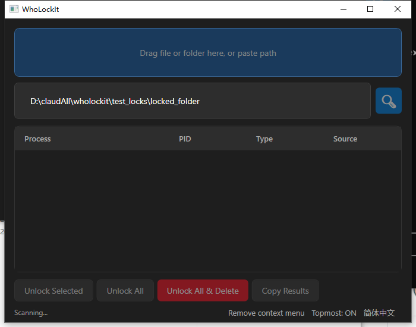

# WhoLockIt

A Windows desktop tool to find out which process is locking your file or folder.

Windows 桌面工具，帮你找出哪个进程占用了你的文件或文件夹。

---

## English

### Features

- **Drag & drop** any file or folder onto the window to scan
- **Dual scanning engine** — Restart Manager (no admin required) + NT API (admin, more thorough)
- **Three unlock modes** — Unlock selected / Unlock all / Unlock all and delete
- **Context menu integration** — Right-click any file or folder in Explorer to scan with WhoLockIt
- **Bilingual UI** — Chinese / English with runtime language toggle
- **Window topmost** toggle

### Screenshot



### Requirements

- Windows 10 or later
- [.NET 10 Desktop Runtime](https://dotnet.microsoft.com/en-us/download/dotnet/10.0)
- Administrator privileges (for NT API scanning and handle unlock)

### Quick Start

Download the latest release from [Releases](../../releases), unzip, and run `WhoLockIt.exe`.

#### Build from Source

```powershell
dotnet publish WhoLockIt/WhoLockIt.csproj -c Release -o publish
# Output: publish/WhoLockIt.exe
```

### Usage

| Action | How |
|--------|-----|
| Scan a file/folder | Drag & drop onto the window, paste a path, or use Explorer right-click menu |
| Unlock a single handle | Select a row in the results grid → **Unlock Selected** |
| Unlock all handles | **Unlock All** |
| Unlock all and delete file | **Unlock All & Delete** |
| Toggle language | Click the language button in the bottom bar |
| Toggle topmost | Click the topmost button in the bottom bar |
| Add Explorer context menu | Click **Add context menu** in the bottom bar |

### Test Locking

The `test_locks/` folder contains scripts to simulate file locks for testing:

```powershell
# Lock a file
.\test_locks\lock.bat

# Lock a folder
.\test_locks\lock_folder.bat

# Force-unlock (kill locking process)
.\test_locks\unlock.bat locked_file.txt
```

---

## 中文

### 功能

- **拖拽** 文件或文件夹到窗口即可扫描
- **双通道扫描** — Restart Manager（无需管理员）+ NT API（管理员，更全面）
- **三种解锁模式** — 解锁选中 / 解锁全部 / 解锁全部并删除
- **右键菜单集成** — 在资源管理器中右键任意文件或文件夹，选择 WhoLockIt 扫描
- **双语界面** — 中文 / 英文，运行时一键切换
- **窗口置顶** 开关

### 截图


### 运行环境

- Windows 10 或更高版本
- [.NET 10 Desktop Runtime](https://dotnet.microsoft.com/en-us/download/dotnet/10.0)
- 管理员权限（NT API 扫描和句柄解锁需要）

### 快速开始

从 [Releases](../../releases) 下载最新版本，解压后运行 `WhoLockIt.exe`。

#### 从源码编译

```powershell
dotnet publish WhoLockIt/WhoLockIt.csproj -c Release -o publish
# 输出: publish/WhoLockIt.exe
```

### 使用方法

| 操作 | 方式 |
|------|------|
| 扫描文件/文件夹 | 拖拽到窗口、粘贴路径，或使用右键菜单 |
| 解锁单个句柄 | 在结果列表中选中一行 → **解锁选中** |
| 解锁全部句柄 | **解锁全部** |
| 解锁全部并删除文件 | **解锁全部并删除** |
| 切换语言 | 点击底栏语言按钮 |
| 切换置顶 | 点击底栏置顶按钮 |
| 添加右键菜单 | 点击底栏 **注入右键菜单** |

### 测试占用

`test_locks/` 目录包含模拟文件占用的脚本：

```powershell
# 占用一个文件
.\test_locks\lock.bat

# 占用一个文件夹
.\test_locks\lock_folder.bat

# 强制解除占用（杀死进程）
.\test_locks\unlock.bat locked_file.txt
```

---

## License

MIT
