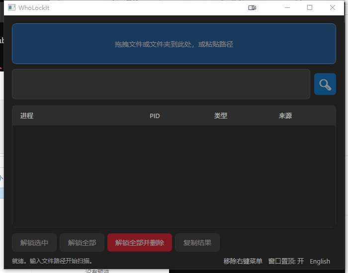

# WhoLockIt

[](README.md)

Windows 桌面工具，帮你找出哪个进程占用了你的文件或文件夹。



## 功能

- **拖拽** 文件或文件夹到窗口即可扫描
- **双通道扫描** — Restart Manager（无需管理员）+ NT API（管理员，更全面）
- **三种解锁模式** — 解锁选中 / 解锁全部 / 解锁全部并删除
- **右键菜单集成** — 在资源管理器中右键任意文件或文件夹，选择 WhoLockIt 扫描
- **双语界面** — 中文 / 英文，运行时一键切换
- **窗口置顶** 开关

## 运行环境

- Windows 10 或更高版本
- [.NET 10 Desktop Runtime](https://dotnet.microsoft.com/en-us/download/dotnet/10.0)
- 管理员权限（NT API 扫描和句柄解锁需要）

## 快速开始

从 [Releases](../../releases) 下载最新版本，解压后运行 `WhoLockIt.exe`。

### 从源码编译

```powershell
dotnet publish WhoLockIt/WhoLockIt.csproj -c Release -o publish
# 输出: publish/WhoLockIt.exe
```

## 使用方法

| 操作 | 方式 |
|------|------|
| 扫描文件/文件夹 | 拖拽到窗口、粘贴路径，或使用右键菜单 |
| 解锁单个句柄 | 在结果列表中选中一行 → **解锁选中** |
| 解锁全部句柄 | **解锁全部** |
| 解锁全部并删除文件 | **解锁全部并删除** |
| 切换语言 | 点击底栏语言按钮 |
| 切换置顶 | 点击底栏置顶按钮 |
| 添加右键菜单 | 点击底栏 **注入右键菜单** |

## 测试占用

`test_locks/` 目录包含模拟文件占用的脚本：

```powershell
# 占用一个文件
.\test_locks\lock.bat

# 占用一个文件夹
.\test_locks\lock_folder.bat

# 强制解除占用（杀死进程）
.\test_locks\unlock.bat locked_file.txt
```

## 许可证

MIT
